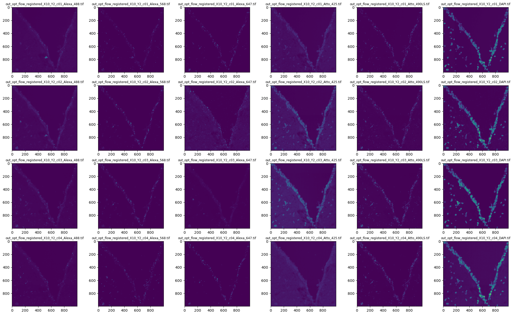

# Onboarding - base module


> [!CAUTION]  
> This onboarding base module is still a work in progress, so if you notice any errors or have any suggestions, please report them [here](https://github.com/BioMeDS/onboarding-base-module/issues) via a Github issue ([Guide](https://docs.github.com/en/issues/tracking-your-work-with-issues/creating-an-issue)).

In bioinformatic projects, beside the work on the subject, a certain organization and structure is important in order to make sure that the work is correct, reproducible, and reusable. This onboarding material guides you through a realistic project (also see the [short project description](./project_description.md)). You will analyse an in-situ sequencing dataset using the python programming language, while using tools that help you follow these basic principles:

- Organizing projects in a standard directory structure (group specific)
- Documentation of your work (README files and literate programming ([jupyter](https://jupyter.org/)))
- Keeping track of your work with version control ([git](https://git-scm.com/))
- Using an **I**ntegrated **D**evelopment **E**nvironment (IDE, [Visual Studio Code](https://code.visualstudio.com/))
- Creating project specific code environments ([mamba](https://mamba.readthedocs.io/en/latest/))

The general workflow consists of alternating steps of work on the project (mostly writing and executing code) and documentation.
After each logical step, the progress is committed to version control.


The [Python](https://www.python.org/) programming language is used for this onboarding.
A basic knowledge of Python is a requisite for this course.
If you want to learn or refresh the basics, check out these resources (you don't need to go through all of them, just pick the one you like most):
- [Self-learning python course](https://github.com/SchardtS/PythonLectures) (by the [CSI group at the CCTB](https://www.biozentrum.uni-wuerzburg.de/cctb/research/supramolecular-and-cellular-simulations/)).
- [Scientific python lectures](https://lectures.scientific-python.org/index.html)
- [Introduction to Programming with Python](https://cs50.harvard.edu/python/2022/)

> [!TIP]
> If you encounter problems and cannot find any help on the linked pages, try to google your problem or look at sites such as [Stackoverflow](https://stackoverflow.com/) or [Reddit](https://www.reddit.com/). You can also try asking [ChatGPT](chat.openai.com), although the quality of the results might vary. If you still have trouble finding a solution to your problem or if you don't understand the solution you found ask your supervisor.

### Biological background

The final goal of the analysis is to determine the spatial localization of transcripts from 50 genes within the mouse brain. 
For this purpose, a published in-situ sequencing (ISS) dataset is used, that utilizes barcodes with four rounds of sequencing.
This dataset has been used to develop a method for ISS barcode decoding, called [PoSTcode](https://www.biorxiv.org/content/10.1101/2021.10.12.464086v1.full).

### Tasks

#### 1. Read through the steps of the base module and understand your tasks

The overall task, determining spatial localization of transcripts, is broken down into sub-tasks.

#### 2. Install the IDE [Visual Studio Code](https://code.visualstudio.com/)

IDEs have useful features such as debugging or autocompletion in the editor as well as integrated version control.
They can also indicate potential errors in the code.
More information about IDEs can be found in the [CCTB Wiki](https://cctb-wiki.biologie.uni-wuerzburg.de/mediawiki/index.php/Beginner%27s_Guide_to_Programming#Integrated_Developer_Environments).
For this onboarding the use of the IDE "Visual Studio Code" (VS Code) is recommended.
A short tutorial about the download and installation can also be found in the [CCTB Wiki](https://cctb-wiki.biologie.uni-wuerzburg.de/mediawiki/index.php/Beginner%27s_Guide_to_Programming#Download_.26_Installation_2).
Install VS Code and go through the walkthrough "Learn the Fundamentals" on the Welcome page (`Help > Welcome`).

#### 3. Create a project folder
On your computer, create a folder for this base module.
We have a [standard folder structure](./folder_structure.md) for projects in our working group.
Understand this folder structure and create this basic structure in your project folder:

```
.
├── code                    ← all script and notebook files
├── data                    ← raw and intermediate data
├── documents               ← abstracts, papers, posters, grant proposals, talks, ...
├── results                 ← intermediate and final results of your analyses
└── README.md               ← high level documentation, links to analyses and summary of results
```

#### 4. Start using git on your project

Version control of your directory and your code is possible with the help of git.
To learn more about what git is and what it can do for you, see [the Software Carpentry lesson on version control]().
A short summary of the most important features of git is given in [the Simple Guide to Git]().
VS Code has built-in version control and its functionality is explained in this [guide](https://code.visualstudio.com/docs/sourcecontrol/intro-to-git).
However, before version control with git is possible, it must first be installed if you are using Windows.
Click [here](https://git-scm.com/downloads) to go to the git download page.

After installation, you need to configure git once (on every system you use git on):
```bash
git config --global user.name "Your Name"
git config --global user.email "your@email.address"
```
The setting `user.name` is not an username for any system or website, it is simply the name of the user.
This repository will be synchronized with a remote repository (e.g. on [GitHub](https://github.com)), later on.
Generally, `git` is a program for version control on your computer and completely independent of the website GitHub, which allows hosting and sharing of git repositories.

#### 5. Create a README
Create a fille called README.md or README.txt for your project and write a short introduction. This README is used to explain what you're doing so others can understand your repository and approach to the tasks.

#### 6. Download the data provided by this [realistic dataset](https://www.ebi.ac.uk/biostudies/bioimages/studies/S-BSST700)
The dataset consists of 171 selected tiles from the right hemisphere of a mouse brain. Each tile has the dimensions 1000x1000 pixels and contains 6 imaging channels (nuclei channel, anchor channel and 4 coding channels) in which different markers were used. For each tile 4 sequencing rounds were performed.

To download all the files, you have to manually download each file on its own if you use Windows. On Linux you can download all files together using FTP. The dataset consists of the following files:

| File | Explanation |
| ---- | ----------- |
| channel_infos.csv | Relates each image channel to its corresponding code |
| taglist.csv | Codebook of barcodes used in the experiment |
| tile_names.csv | Names (coordinates) of selected tiles |
| selected_tiles_map.png | Map of selected tiles |
| selected-tiles.zip | Registered tif images of selected tiles |
| decoding.zip | Decoding of the selected ISS tiles via different methods |

The files can then be unpacked. This should be done for the selected tiles in particular.

#### 7. Use ```.gitignore``` on the downloaded data to prevent it from being committed to git
Create a file called ```.gitignore``` and input the names/paths of files and/or folders that should not be included in the git commit. This ```.gitignore``` file has to be in your repository.

#### 8. Update your README with details about the data
Like mentioned in *6. Create a README* you should explain everything so others can understand it. Include information about your data. What is the data? What files are used? What does the data mean? and so on.

#### 9. Inspect the data visually
Now that you handled most of the organizational stuff of this base module you can finally have a look at the downloaded data. Use some image files and have a look at them in a standard image viewer on your Computer.

#### 10. Install Mamba
To start using python to analyse and visualize the data, you must first install Mamba. Mamba is a package manager that enables easy installation and handling of needed packages. Use this [link](https://github.com/conda-forge/miniforge?tab=readme-ov-file#miniforge3) to install Miniforge3 (Mamba).

> [!WARNING]
> If you are on Windows, make sure, to check all boxes in the "Advanced Installation Options", particularly the option "Add Miniforge3 to PATH environment variable" (even though it is listed as not recommended, see https://github.com/BioMeDS/onboarding-base-module/issues/12).
Finalize the mamba installation by choosing "Git Bash" as your default terminal profile in VS Code and running `mamba init bash` in a Git Bash.
After that, open a new Git Bash terminal and you are ready to use mamba.

#### 11. Create the project environment and install the required packages. 
Once Miniforge3 (Mamba) is installed you have to create a project environment. Create a `environment.yml` file first with the content below as reference.

```yml
dependencies:
  - numpy
  - pandas=2.0.1
```
For this base module you need the latest version of python as well as the packages ```matplotlib```, ```scikit-image``` and ```ipykernel```.

With the command ```mamba env create -f environment.yml --name NAME``` (```NAME``` = How you want to call your environment) you can create your new mamba environment based on your .yml file. If you want to install each package individually, this works with the command ```mamba install PACKAGE``` (```PACKAGE``` = The name of the package). You can also install several packages at once by including them all in the ```mamba install``` command (separated by spaces). For example: ```mamba install numpy pandas=2.0.1```. With the command ```mamba remove PACKAGE``` packages can be removed.

> [!NOTE]
> Don't forget the workflow mentioned at the top of the base module!

---

#### 12. Install the VS Code Extension "Jupyter" for Jupyter Notebook support
The use of the Jupyter extension in VS Code combines the versatility of both "VS Code" and "Jupyter Notebook". 

#### 13. Create a figure that incorporates all runs (c1 - c4) of one tile as subplots.
Create two files: ```Analysis.ipynb``` and ```Functions.py```. When creating the ```.ipynb``` file in VS Code it wants you to select a kernel. Here you choose the environment you created in the previous task. The ```.ipynb``` file is where you write your code. Write your code as a function that can be used to analyse any given tile of the data. You can then save the function in the ```.py``` file so that you can also use it in other ```.ipynb``` files.

As this task is about image analysis, you can read more about that [here](https://haesleinhuepf.github.io/BioImageAnalysisNotebooks/intro.html).

##### 13.1. Plot one image
Plot the following file using matplotlib.pyplot: ```out_opt_flow_registered_X10_Y10_c01_DAPI.tif```
<details>
    <summary>Help</summary>
First you have to unpack the selected-tiles.zip. Then import the needed packages (skimage, matplotlib.pyplot, glob). Now you can plot one of the images. To do this, the image must first be saved in a variable using ski.io.imread("PATH/out_opt_flow_registered_X10_Y10_c01_DAPI.tif"). This variable can then be plotted with matplotlib.pyplot. An alternative to plotting with matplotlib.pyplot would be to display the image directly with ski.io.imshow("PATH/out_opt_flow_registered_X10_Y10_c01_DAPI.tif") instead of saving the image in a variable.
</details>

##### 13.2. Create a list of files
Load all X10_Y10 images into a list.
<details>
    <summary>Help</summary>
You can use glob.glob() to save all needed files in the selected-tiles folder in a variable. To import all X_10_Y10 images and only them you have to tell glob which files it has to save. You do this with glob.glob("PATH/out_opt_flow_registered_X10_Y10_*.tif"). This nomenclature with * tells glob, that it should look for all files that have the same name (before *). You can then iterate over all the files in the glob variable and use scikit-image (ski.io.imread()) to read in the files and save them in a list. 
</details>

##### 13.3. Plot a grid of images
Create a grid of all the X10_Y10 images so that they are arranged as follows:

| | | | | | |
| -------- | -------- | -------- | -------- | -------- | -------- |
| *_c01_Alexa_488.tif | *_c01_Alexa_568.tif | *_c01_Alexa_647.tif | *_c01_Atto_425.tif | *_c01_Atto_490LS.tif | *_c01_DAPI.tif |
| *_c02_Alexa_488.tif | *_c02_Alexa_568.tif | *_c02_Alexa_647.tif | *_c02_Atto_425.tif | *_c02_Atto_490LS.tif | *_c02_DAPI.tif |
| *_c03_Alexa_488.tif | *_c03_Alexa_568.tif | *_c03_Alexa_647.tif | *_c03_Atto_425.tif | *_c03_Atto_490LS.tif | *_c03_DAPI.tif |
| *_c04_Alexa_488.tif | *_c04_Alexa_568.tif | *_c04_Alexa_647.tif | *_c04_Atto_425.tif | *_c04_Atto_490LS.tif | *_c04_DAPI.tif |

<details>
    <summary>Help</summary>
    To do this, you need to use matplotlib.pyplot.subplots() and use a for loop to iterate over the list of images you created in 13.2. The example image was plottet using the following code (ignoring the names above the tiles):

```python
fig, axs = plt.subplots(4, 6, figsize=(25, 15))
for i, ax in enumerate(axs.flatten()):
    ax.imshow(image_array[i])
plt.show()
```

The variable `image_array` contains a list of image files that was created using `ski.io.imread()`.
    
</details>

Example for tile X10 Y2:



#### 14. Count the number of nuclei in each field of view (fov)

##### 14.1 Develop method on a single fov

Write a jupyter notebook to explore a single field of view.
- Which channel(s) is/are most promising for nucleus segmentation?
- Which methods can you use, to distinguish between nucleus and the rest?
- How can you devide the nuclei into separate instances?
- Which problems occur, how can they be addressed?

Beside the nucleus count, also create a diagnostic figure, that helps a human to see, whether your method worked or failed.
When you have a method that works well on your selected fov, try it on some other fovs

##### 14.2 Run your method on all fovs

Write a script that applies your method to all fovs.
Write the count per fov to a csv file and save the diagnostic plots as png files in a folder.

#### 15. Find and identify the transcripts

Finally, we want to detect all transcripts and identify the corresponding gene.
In order to achieve this, start again with a single field of view.

##### 15.1 Spot detection

First you need to identify the spots in each relevant image (all four sequencing channels and all four rounds).
You can either identify them on each image individually or combine them (e.g. throug maximum intensity projection) and identify all spot locations at once.
Also, the mysterious 6th channel (beside dapi and the four sequencing channels) might be useful.
You might want to apply some pre-processing steps to enhance the spots prior to detection.

##### 15.2 Barcode decoding

For each spot location, you need to find out which channel is active in which round (e.g. first round: A, second round G, ...).
Possible complications are cases, where no channel or multiple channels have high intensity within the same round of sequencing.
You may discard these spots for now, but think about ways those cases could be tracked.
Once you have the barcode for a spot, look up the corresponding gene in the `taglist.csv`, assign unknown barcodes to "invalid".
Save your predictions in a csv file, containing columns: `fov, x, y, barcode, gene`

##### 15.3 Visualize results in napari

Create a script to visualize and inspect your results by programmatically opening all images in napari:
- create a separate layer for all four images of each sequencing channel
- set color to (A=magenta, G=green, T=yellow, C=red) and blending to "additive"
- add your predicted spots as a points layer
- *(optional)* add the barcode (and decoded gene) as properties for the points, to be used as text
- *(optional)* add dapi as another layer

##### 15.4 All fovs

Run spot detection and barcode decoding for all fovs, creating a single csv file with predictions for all fovs.
Create another csv file with aggregated counts for each gene and fov: `fov, gene, count`

##### 15.5 *(optional)* Compare your results with other methods

The file `decoding.zip` contains spot locations and decodings, created with different methods.
Compare your results on count basis or on individual spot basis.
Include these reference decodings in your napari visualization.
Looking at some predictions manually, which method do you agree most with?

#### 16. Write a protocol

See the [protocol guidelines](protocol_guidelines.md).

### Further resources
- [6 Steps Towards Reproducible Research by Heidi Seibold](resources/steps-reproducible.pdf)
