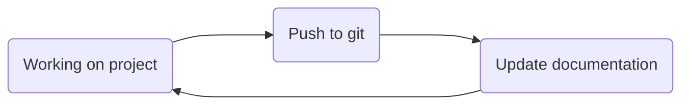

# onboarding-base-module

A certain organization and structure is important in order to work cleanly. To help with this, there is this onboarding, which is intended to convey the following basic concepts:

- **I**ntegrated **D**evelopment **E**nvironment (IDE)
- Project directory structure (group specific)
- Version control with [git](https://git-scm.com/)
- Documentation
- Code environments

Essentially, this workflow should be applied:


The [Python](https://www.python.org/) programming language is used for this onboarding.

### Tasks
1. Read through the instruction repository and understand the task
2. Install the IDE [Visual Studio Code](https://code.visualstudio.com/)
3. Install the VS Code Extension "Jupyter" for Jupyer Notebook support
4. Create a repository based on the basic structure provided
5. Start using git on your project using ```git init```
6. Create a README for your project and write a short introduction
7. Download the data provided by this [realistic dataset](https://www.ebi.ac.uk/biostudies/bioimages/studies/S-BSST700)
8. Use ```.gitignore``` on the downloaded data to prevent it from being committed to git
9. Update your README with details about the data
10. Inspect the data visually using ***program***
11. Install [mamba](https://mamba.readthedocs.io/en/latest/installation/mamba-installation.html) (mamba - miniforge)
12. Create the project environment and install the required packages. Use the provided .txt / .yml file. This can be done with the following command: *mamba env create --prefix ./env --file **file***
