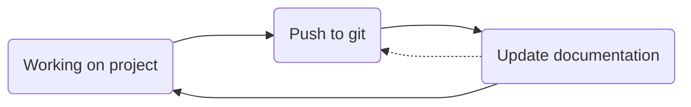

# onboarding-base-module

A certain organization and structure is important in order to work cleanly. To help with this, there is this onboarding, which is intended to convey the following basic concepts:

- **I**ntegrated **D**evelopment **E**nvironment (IDE)
- Project directory structure (group specific)
- Version control with [git](https://git-scm.com/)
- Documentation
- Code environments

Essentially, this workflow should be applied:


The [Python](https://www.python.org/) programming language is used for this onboarding.

### Tasks
#### 1. Read through the instruction repository and understand the task
The task of this base module is to create a figure based on a realistic dataset. To do this, important programs etc. must first be installed and an environment created for the project. Another goal is to learn best practices and get a good workflow.

#### 2. Install the IDE [Visual Studio Code](https://code.visualstudio.com/)
It is advisable to use an IDE, as these have useful features such as debugging or autocompletion in the editor as well as version control. They can also indicate potential errors in the code. Things like this are especially useful when you are just starting out with programming. More information about IDEs can be found in the [CCTB Wiki](http://10.87.174.31/mediawiki/index.php/Beginner%27s_Guide_to_Programming#Integrated_Developer_Environments). For this onboarding the use of the IDE "Visual Studio Code" (VS Code) is recommended. A short tutorial about the download and installation can also be found in the [CCTB Wiki](http://10.87.174.31/mediawiki/index.php/Beginner%27s_Guide_to_Programming#Download_.26_Installation_2).

#### 3. Install the VS Code Extension "Jupyter" for Jupyer Notebook support
The use of the Jupyter extension in VS Code combines the versatility of both "VS Code" and "Jupyter Notebook". 

#### 4. Create a repository based on the basic structure provided
| Folder | Explanation |
| -------- | -------- |
| data     | Your data is stored here     |
| code     | Your code is stored here     |
| communication     | Any images/posters etc. that can be used for publications and such are stored here     |
| results     | Your results are stored here. This includes your results and end results     |

#### 5. Start using git on your project
To start using git, open your Terminal (Linux) or your Command prompt (Windows) and go to your repository. For this you can use ```cd PATH```. Then write ```git init```and hit enter. This initializes the use of git in the repository. To add files to git you have to use the command ```git add FILE``` and to commit the files that were added you have to use the command ```git commit -m "MESSAGE"```, where "MESSAGE" should be a short message about what you commited or what updates you did. If you want to check what files have been added or what changes were made you can use ```git status```. A history of commits can be found via ```git log```. A guide about git that was created by GitHub can be found [here](https://github.com/git-guides).

#### 6. Create a README
Create a README.txt or README.md for your project and write a short introduction. This README is used to explain what you're doing so others can understand your repository and approach to the tasks.

#### 7. Download the data provided by this [realistic dataset](https://www.ebi.ac.uk/biostudies/bioimages/studies/S-BSST700)
To download all of the files, you have to manually download each file on its own if you use Windows. On Linux you can download all files together using FTP. The dataset consists of the following files:

| File | Explanation |
| ---- | ----------- |
| channel_infos.csv | Information about what marker was used for what channel |
| taglist.csv | List of tags and their corresponding base codes |
| tile_names.csv | List of all tile names |
| selected_tiles_map.png | Overview of all tiles with used tiles highlighted in red |
| selected-tiles.zip | This is the data. Files contain their tile info as well as their run (c) and the marker that was used |
| decoding.zip | ??? |

TO DO 

#### 8. Use ```.gitignore``` on the downloaded data to prevent it from being committed to git
Create a file called ```.gitignore``` and input the names/paths of files and/or folders that should not be included in the git commit. This ```.gitignore``` file has to be in your repository.

#### 9. Update your README with details about the data
Like mentioned in *6. Create a README* you should explain everything so others can understand it. Include information about your data. What is the data? What files are used? What does the data mean? and so on.

#### 10. Inspect the data visually
Now that you handled most of the organizational stuff of this base module you can finally have a look at the downloaded data. Use some image files and have a look at the in a standard image viewer on your Computer.

#### 11. Install [mamba](https://github.com/conda-forge/miniforge?tab=readme-ov-file#miniforge3)
To start using python to analyse and visualize the data, you must first install Mamba. Mamba is a package manager that enables easy installation and handling of needed packages. Use this [link](https://github.com/conda-forge/miniforge?tab=readme-ov-file#miniforge3) to install Miniforge3.

#### 12. Create the project environment and install the required packages. 
Once Miniforge3 (Mamba) is installed you have to create a project environment. Create a `environment.yml` file first with the content below as reference.

```yml
dependencies:
  - numpy
  - pandas=2.0.1
```
For this base module you need the latest version of python as well as the packages ```matplotlib``` and ```scikit-image```.

With the command ```mamba env create -f environment.yml --name NAME``` you can create your new mamba environment based on your .yml file.

---

#### 13. Create a figure that incorporates all runs (c1 - c4) of one tile as subplots.
When creating a ```.ipynb``` file in VS Code it wants you to select a kernel. Here you choose the environment you created in the previous task. As this task is about image analysis, you can read more about that [here](haesleinhuepf.github.io/BioImageAnalysisNotebooks). Write your code as a function that can be stored in a ```.py``` file and can be used to analyse any given tile of the data.

##### 13.1. Load the files
Load all the files in *selected-tiles* into a list, so you can access them if needed.
<details>
    <summary>Help</summary>
    TO DO
</details>

##### 13.2. Plot one of the images
TO DO
<details>
    <summary>Help</summary>
    TO DO
</details>

##### 13.3. Plot a grid of corresponding images
Create a grid from the various runs and channels for a specific tile.
<details>
    <summary>Help</summary>
    TO DO
</details>

Example for tile X10 Y2:


